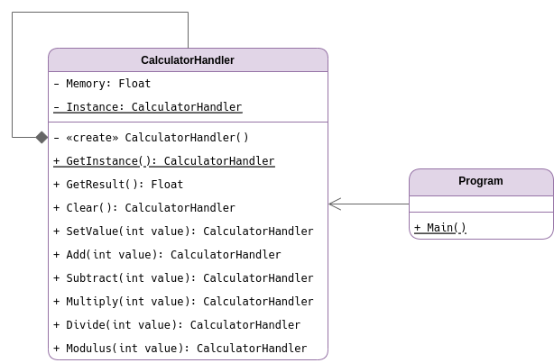
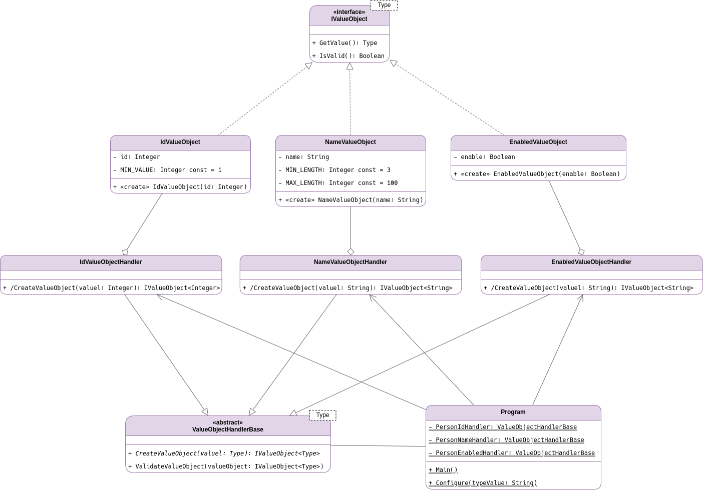
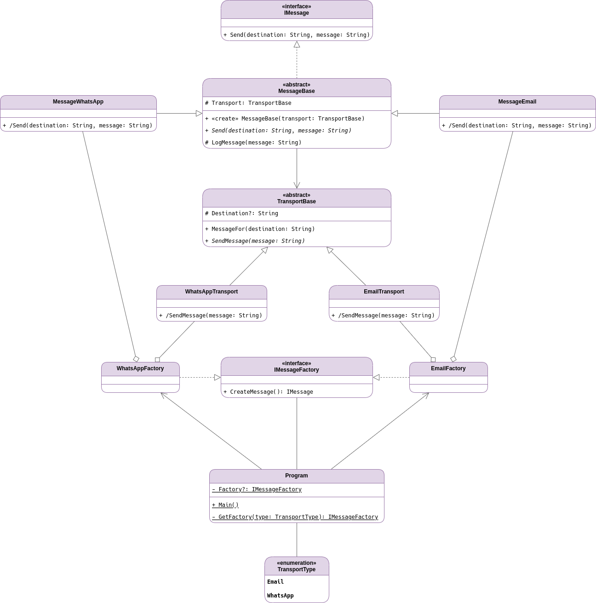
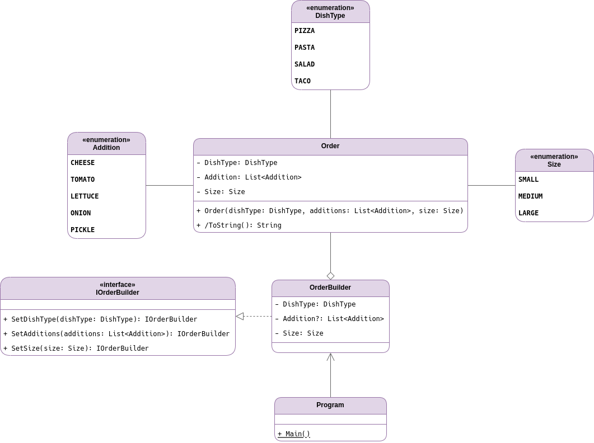

# Trabajo #1: Patrones y Diseño de Software

## Planteamiento

### Punto 1. Definición del problema que se desean abordar

Definir cuatro problemas y donde se puedan implementar cuatro patrones creacionales distintos, justificando porqué la aplicación del patrón da solución al problema planteado.

Los problemas pueden estar relacionados o ser independientes entre sí, la temática es libre.

### Punto 2. Diagrama UML de Clases

Para cada uno de los problemas definidos en el punto 1, elaborar el diagrama UML donde se evidencie la estructura del patrón de diseño, explicando la correspondencia con los participantes.

Es importante que los nombres de las clases se adapten al dominio, es decir, no dejar nombres de clases genéricas o igual a como se presentan en el material de estudio.

Se esperan cuatro diagramas diferentes o un único diagrama que implemente los cuatro patrones seleccionados.

### Punto 3. Implementación de los patrones diseño

Implementar en el lenguaje de su elección las clases y los objetos que hacen parte de los cuatro patrones creacionales, evidenciando un correcto uso de los mismos y siguiendo principios SOLID.

No es necesario implementar funcionalidades, es suficiente con mostrar mensajes por consola donde se evidencie el funcionamiento del patrón.

## Solución

### Singleton

Se requiere desarrollar un sistema para una aplicación de cálculos matemáticos en la cual se debe mantener un estado consistente de memoria durante todas las operaciones. Este estado de memoria debe ser único y accesible a través de toda la aplicación para asegurar que cualquier operación aritmética pueda continuar desde el último resultado calculado.

El sistema también requiere una interfaz sencilla que permita realizar operaciones de suma, resta, multiplicación, división y módulo, así como establecer un nuevo valor de cálculo y borrar el estado actual de memoria cuando sea necesario. Todo esto mientras se mantiene una estructura de programación clara y mantenible.

El sistema debe prevenir la creación de múltiples instancias de control de cálculos que podrían llevar a resultados inconsistentes o uso ineficiente de recursos, por lo cual se implementa el patrón de diseño Singleton, pues permite que el manejo de la memoria de cálculos se realice de manera centralizada, para que todos los componentes de la aplicación puedan realizar operaciones utilizando la misma instancia del estado de memoria, asegurando así la integridad y la consistencia de los datos a través de todas las operaciones.

### Factory Method

Se requiere desarrollar una aplicación que permita la creación de diferentes tipos de objetos de valor (Value Objects) con propiedades distintas: identificadores numéricos, nombres de entidades y estados de habilitación. Cada uno de estos objetos tiene reglas de validación únicas y formas de creación específicas; por ejemplo, los identificadores deben ser enteros positivos, los nombres deben tener una longitud que respete un mínimo y máximo establecido, y los estados de habilitación son valores booleanos.

El sistema debe permitir agregar nuevos tipos de objetos de valor en el futuro sin alterar la lógica de creación existente. Además, es necesario que el proceso de validación de las propiedades de estos objetos se realice de manera centralizada para asegurar la integridad de los datos antes de su utilización en la aplicación. 

Los objetos de valor serán usados en diferentes partes de la aplicación, lo que requiere una instancia de manejo adecuado para cada tipo de objeto que asegure su correcta instanciación y validación antes de ser entregados para su uso posterior. Además, el sistema debe ser capaz de integrarse con una función principal que configure y maneje estos objetos basándose en una cadena de texto que especifique el tipo de objeto de valor deseado.

Se integra el patrón de diseño Factory Method a la solución pues permite que al momento agregar nuevos tipos de objetos de valor, no sea necesario alterar la lógica de creación de los objetos existentes ya que proporciona una estructura que soporte la extensión y el mantenimiento eficiente del código, permitiendo que los componentes del sistema trabajen juntos sin depender entre sí.

### Abstract Factory

Es necesaria una aplicación cuya funcionalidad principal es la de enviar mensajes a los usuarios, pero la forma de envío puede variar significativamente dependiendo de la preferencia del usuario o del contexto de uso. Algunos usuarios prefieren recibir notificaciones a través de correo electrónico, mientras que otros optan por mensajes de WhatsApp. Cada método de envío tiene su propia lógica y configuración, como el formato del mensaje y los detalles de la conexión.

La solución debe facilitar la extensión de los tipos de mensajes y su correspondiente lógica de envío de una manera estructurada, permitiendo que la aplicación determine dinámicamente cuál método de envío utilizar basándose en la configuración o las preferencias del usuario. La aplicación deberá proporcionar una interfaz unificada para enviar mensajes que pueda adaptarse a los distintos tipos de transporte de mensajes sin alterar el núcleo funcional del sistema.

Usar el patrón Abstract Factory, permite mantener la arquitectura limpia y modular que la aplicación necesita para ser capaz de seleccionar y utilizar el método de transporte de mensajes adecuado; sin estar acoplada a una implementación específica. Además, permite considerar la posibilidad de integrar nuevos métodos de envío en el futuro, como SMS o mensajes de redes sociales, sin que esto requiera una reestructuración mayor del sistema.

### Builder

Una empresa de software está desarrollando un sistema de pedidos para un restaurante que ofrece una variedad de platos como pizzas, pastas, ensaladas y tacos. Cada plato puede personalizarse con diferentes adiciones como queso, tomate, lechuga, cebolla y pepinillos, y además puede tener diferentes tamaños: pequeño, mediano o grande. Los clientes suelen tener preferencias específicas y combinaciones complejas en sus pedidos, lo que requiere una forma flexible y clara de construir estos pedidos con múltiples atributos.

El sistema debe permitir a los usuarios construir un pedido paso a paso, seleccionando el tipo de plato, agregando las adiciones deseadas y eligiendo el tamaño, sin exponer la complejidad de la creación del pedido final al cliente. Esta solución también debe ser escalable para permitir la fácil incorporación de nuevos platos, adiciones o tamaños en el futuro.

La solución debe ser capaz de manejar pedidos con diferentes combinaciones de atributos sin forzar al cliente a pasar por un proceso de creación de pedidos complicado o propenso a errores, proporcionando así una experiencia de usuario suave y eficiente al realizar pedidos personalizados. Además, el restaurante requiere que la representación del pedido final sea clara y detallada para facilitar la preparación y entrega precisa de los platos personalizados.

El patrón Builder es adecuado para la solución de software desarrollada para el restaurante; pues permite creación de ordenes representadas como configuraciones independientes paso a paso, justo como el problema lo requiere y hace altamente escalable la aplicación al permitir la incorporación de nuevos platos e ingredientes de manera sencilla en el momento que sea requerido.

